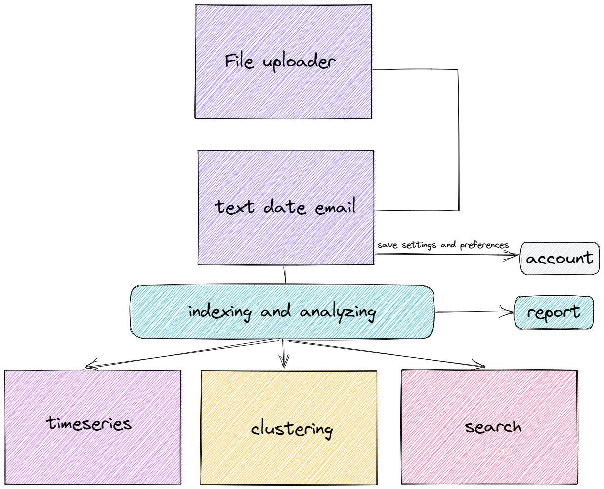

> This project is a UI source code for the <a href="https://github.com/atomicai/patronus/">patronus</a> project. 

---

### Workflow
> This is simple. Once you submit the file, fill in the "text" and "date" column names, if necessary, and wait a bit for magic to happen 🪄.

### Installation

> Before running any command below make sure you have <a href="https://github.com/nvm-sh/nvm">nvm</a> manager installed.

1. Install <a href="https://www.npmjs.com/">npm</a> via `nvm install node`
2. Install <a href="https://yarnpkg.com/">yarn</a> package manager via `npm install -g yarn` 
P.S make sure you install it globally!

### Building

> To build the production bundle you need to clone the repo, install the dependencies and finally produce the bundle.

1. `git clone https://github.com/atomicai/patronumui.git && cd patronumui`
2. `yarn`
3. `yarn build`

> That's it. Now you have "<u>build</u>" folder that is ready to be served.